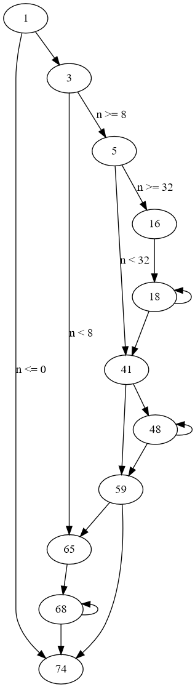

This is a brief exploration of bad codegen by an over-zealous optimizer.

- [Intro](#intro)
- [The problem](#the-problem)
- [Domain restrictions](#domain-restrictions)
- [Lookup table](#lookup-table)
- [Branchless](#branchless)
- [Benchmarks](#benchmarks)

## Intro

Consider a basic factorial function:

```cpp
int factorial(int n) {
    if(n <= 0) [[unlikely]] return 1;
    return n * factorial(n-1);
}
```

Here is [clang's codegen](https://godbolt.org/z/dM7v8cbPT) for the function, with optimizations on:

```assembly
.LCPI0_0:
        .long   0                               ## 0x0
        .long   4294967295                      ## 0xffffffff
        .long   4294967294                      ## 0xfffffffe
        .long   4294967293                      ## 0xfffffffd
.LCPI0_1:
        .long   1                               ## 0x1
        .long   1                               ## 0x1
        .long   1                               ## 0x1
        .long   1                               ## 0x1
.LCPI0_2:
        .long   4294967292                      ## 0xfffffffc
        .long   4294967292                      ## 0xfffffffc
        .long   4294967292                      ## 0xfffffffc
        .long   4294967292                      ## 0xfffffffc
.LCPI0_3:
        .long   4294967288                      ## 0xfffffff8
        .long   4294967288                      ## 0xfffffff8
        .long   4294967288                      ## 0xfffffff8
        .long   4294967288                      ## 0xfffffff8
.LCPI0_4:
        .long   4294967284                      ## 0xfffffff4
        .long   4294967284                      ## 0xfffffff4
        .long   4294967284                      ## 0xfffffff4
        .long   4294967284                      ## 0xfffffff4
.LCPI0_5:
        .long   4294967280                      ## 0xfffffff0
        .long   4294967280                      ## 0xfffffff0
        .long   4294967280                      ## 0xfffffff0
        .long   4294967280                      ## 0xfffffff0
.LCPI0_6:
        .long   4294967276                      ## 0xffffffec
        .long   4294967276                      ## 0xffffffec
        .long   4294967276                      ## 0xffffffec
        .long   4294967276                      ## 0xffffffec
.LCPI0_7:
        .long   4294967272                      ## 0xffffffe8
        .long   4294967272                      ## 0xffffffe8
        .long   4294967272                      ## 0xffffffe8
        .long   4294967272                      ## 0xffffffe8
.LCPI0_8:
        .long   4294967268                      ## 0xffffffe4
        .long   4294967268                      ## 0xffffffe4
        .long   4294967268                      ## 0xffffffe4
        .long   4294967268                      ## 0xffffffe4
.LCPI0_9:
        .long   4294967264                      ## 0xffffffe0
        .long   4294967264                      ## 0xffffffe0
        .long   4294967264                      ## 0xffffffe0
        .long   4294967264                      ## 0xffffffe0
factorial(int):                          ## @factorial(int)
        mov     eax, 1
        test    edi, edi
        jle     .LBB0_12
        cmp     edi, 8
        jb      .LBB0_11
        mov     ecx, edi
        and     ecx, -8
        movd    xmm0, edi
        pshufd  xmm5, xmm0, 0                   ## xmm5 = xmm0[0,0,0,0]
        paddd   xmm5, xmmword ptr [rip + .LCPI0_0]
        lea     esi, [rcx - 8]
        mov     edx, esi
        shr     edx, 3
        add     edx, 1
        mov     eax, edx
        and     eax, 3
        cmp     esi, 24
        jae     .LBB0_4
        movdqa  xmm1, xmmword ptr [rip + .LCPI0_1] ## xmm1 = [1,1,1,1]
        movdqa  xmm4, xmm1
        jmp     .LBB0_6
.LBB0_4:
        and     edx, -4
        neg     edx
        movdqa  xmm1, xmmword ptr [rip + .LCPI0_1] ## xmm1 = [1,1,1,1]
        movdqa  xmm9, xmmword ptr [rip + .LCPI0_3] ## xmm9 = [4294967288,4294967288,4294967288,4294967288]
        movdqa  xmm10, xmmword ptr [rip + .LCPI0_4] ## xmm10 = [4294967284,4294967284,4294967284,4294967284]
        movdqa  xmm11, xmmword ptr [rip + .LCPI0_5] ## xmm11 = [4294967280,4294967280,4294967280,4294967280]
        movdqa  xmm12, xmmword ptr [rip + .LCPI0_6] ## xmm12 = [4294967276,4294967276,4294967276,4294967276]
        movdqa  xmm13, xmmword ptr [rip + .LCPI0_7] ## xmm13 = [4294967272,4294967272,4294967272,4294967272]
        movdqa  xmm14, xmmword ptr [rip + .LCPI0_8] ## xmm14 = [4294967268,4294967268,4294967268,4294967268]
        movdqa  xmm15, xmmword ptr [rip + .LCPI0_9] ## xmm15 = [4294967264,4294967264,4294967264,4294967264]
        movdqa  xmm4, xmm1
.LBB0_5:                                ## =>This Inner Loop Header: Depth=1
        movdqa  xmm0, xmm5
        paddd   xmm0, xmmword ptr [rip + .LCPI0_2]
        pshufd  xmm6, xmm1, 245                 ## xmm6 = xmm1[1,1,3,3]
        pshufd  xmm7, xmm5, 245                 ## xmm7 = xmm5[1,1,3,3]
        pmuludq xmm7, xmm6
        pmuludq xmm1, xmm5
        pshufd  xmm6, xmm4, 245                 ## xmm6 = xmm4[1,1,3,3]
        pshufd  xmm2, xmm0, 245                 ## xmm2 = xmm0[1,1,3,3]
        pmuludq xmm2, xmm6
        pmuludq xmm0, xmm4
        movdqa  xmm4, xmm5
        paddd   xmm4, xmm9
        movdqa  xmm6, xmm5
        paddd   xmm6, xmm10
        pmuludq xmm1, xmm4
        pshufd  xmm4, xmm4, 245                 ## xmm4 = xmm4[1,1,3,3]
        pmuludq xmm4, xmm7
        pmuludq xmm0, xmm6
        pshufd  xmm6, xmm6, 245                 ## xmm6 = xmm6[1,1,3,3]
        pmuludq xmm6, xmm2
        movdqa  xmm2, xmm5
        paddd   xmm2, xmm11
        movdqa  xmm7, xmm5
        paddd   xmm7, xmm12
        pshufd  xmm3, xmm2, 245                 ## xmm3 = xmm2[1,1,3,3]
        pmuludq xmm3, xmm4
        pmuludq xmm2, xmm1
        pshufd  xmm8, xmm7, 245                 ## xmm8 = xmm7[1,1,3,3]
        pmuludq xmm8, xmm6
        pmuludq xmm7, xmm0
        movdqa  xmm0, xmm5
        paddd   xmm0, xmm13
        movdqa  xmm6, xmm5
        paddd   xmm6, xmm14
        pmuludq xmm2, xmm0
        pshufd  xmm1, xmm2, 232                 ## xmm1 = xmm2[0,2,2,3]
        pshufd  xmm0, xmm0, 245                 ## xmm0 = xmm0[1,1,3,3]
        pmuludq xmm0, xmm3
        pshufd  xmm0, xmm0, 232                 ## xmm0 = xmm0[0,2,2,3]
        punpckldq       xmm1, xmm0              ## xmm1 = xmm1[0],xmm0[0],xmm1[1],xmm0[1]
        pmuludq xmm7, xmm6
        pshufd  xmm4, xmm7, 232                 ## xmm4 = xmm7[0,2,2,3]
        pshufd  xmm0, xmm6, 245                 ## xmm0 = xmm6[1,1,3,3]
        pmuludq xmm0, xmm8
        pshufd  xmm0, xmm0, 232                 ## xmm0 = xmm0[0,2,2,3]
        punpckldq       xmm4, xmm0              ## xmm4 = xmm4[0],xmm0[0],xmm4[1],xmm0[1]
        paddd   xmm5, xmm15
        add     edx, 4
        jne     .LBB0_5
.LBB0_6:
        movdqa  xmm0, xmm1
        movdqa  xmm6, xmm4
        test    eax, eax
        je      .LBB0_9
        neg     eax
        movdqa  xmm2, xmmword ptr [rip + .LCPI0_2] ## xmm2 = [4294967292,4294967292,4294967292,4294967292]
        movdqa  xmm3, xmmword ptr [rip + .LCPI0_3] ## xmm3 = [4294967288,4294967288,4294967288,4294967288]
.LBB0_8:                                ## =>This Inner Loop Header: Depth=1
        movdqa  xmm6, xmm5
        paddd   xmm6, xmm2
        movdqa  xmm0, xmm5
        pmuludq xmm0, xmm1
        pshufd  xmm0, xmm0, 232                 ## xmm0 = xmm0[0,2,2,3]
        pshufd  xmm1, xmm1, 245                 ## xmm1 = xmm1[1,1,3,3]
        pshufd  xmm7, xmm5, 245                 ## xmm7 = xmm5[1,1,3,3]
        pmuludq xmm7, xmm1
        pshufd  xmm1, xmm7, 232                 ## xmm1 = xmm7[0,2,2,3]
        punpckldq       xmm0, xmm1              ## xmm0 = xmm0[0],xmm1[0],xmm0[1],xmm1[1]
        pshufd  xmm1, xmm6, 245                 ## xmm1 = xmm6[1,1,3,3]
        pmuludq xmm6, xmm4
        pshufd  xmm6, xmm6, 232                 ## xmm6 = xmm6[0,2,2,3]
        pshufd  xmm4, xmm4, 245                 ## xmm4 = xmm4[1,1,3,3]
        pmuludq xmm4, xmm1
        pshufd  xmm1, xmm4, 232                 ## xmm1 = xmm4[0,2,2,3]
        punpckldq       xmm6, xmm1              ## xmm6 = xmm6[0],xmm1[0],xmm6[1],xmm1[1]
        paddd   xmm5, xmm3
        movdqa  xmm1, xmm0
        movdqa  xmm4, xmm6
        inc     eax
        jne     .LBB0_8
.LBB0_9:
        pshufd  xmm1, xmm0, 245                 ## xmm1 = xmm0[1,1,3,3]
        pshufd  xmm2, xmm6, 245                 ## xmm2 = xmm6[1,1,3,3]
        pmuludq xmm2, xmm1
        pmuludq xmm6, xmm0
        pshufd  xmm0, xmm6, 238                 ## xmm0 = xmm6[2,3,2,3]
        pmuludq xmm0, xmm6
        pshufd  xmm1, xmm2, 170                 ## xmm1 = xmm2[2,2,2,2]
        pmuludq xmm1, xmm2
        pmuludq xmm1, xmm0
        movd    eax, xmm1
        cmp     ecx, edi
        je      .LBB0_12
        and     edi, 7
.LBB0_11:                               ## =>This Inner Loop Header: Depth=1
        imul    eax, edi
        lea     ecx, [rdi - 1]
        cmp     edi, 1
        mov     edi, ecx
        jg      .LBB0_11
.LBB0_12:
        ret
```

This is madness.

Clang is doing a very impressive job of unrolling and vectorizing here. This code is fantastic...
but only for large inputs (e.g. `n >= 100`). Herein lies the problem: we're working with 32 bit ints
here. Any input larger than `n = 12` isn't particularly useful.

Clang is generating 3 levels of unrolling / vectorizing: the case for `n < 8`, the case for
`8 < n < 32`, and the case for `n >= 32`.



This codegen is extraordinarily bloated for the use-case and it's a good case study in bad codegen
as a result of an over-zealous optimizer.

## The problem

Ideally the compiler would deduce that only 0 <= n <= 12 yield valuable results and are worth
optimizing for. This is probably not possible, though. The compiler can't know whether we value the
results even after overflow.

## Domain restrictions

What if we tell the compiler the domain of the function?

```cpp
int factorial(int n) {
    __builtin_assume(n <= 12);
    if(n <= 0) [[unlikely]] return 1;
    return n * factorial(n-1);
}
```

The resultant codegen is [not different in the slightest](https://godbolt.org/z/fGTWaraP6). The
compiler should realize that the loop can only execute 13 times and that excessive unrolling is
harmful.

Even with explicitly telling the compiler `n <= 12`, clang is still generating unrolled code for the
case where `n >= 32` (the branch from basic block 5 to basic block 16).

## Lookup table

What's remarkable about this codegen is that all the unrolling and vectorization can be beaten by a
simple lookup table. The only penalty here would come from memory access / a potential cache miss.

```cpp
consteval int f(int n) {
    if(n <= 0) [[unlikely]] return 1;
    return n * f(n-1);
}
#define X(n) case n: return f(n)
int factorial(int n) {
    switch(n) {
        X(0);
        X(1);
        X(2);
        X(3);
        X(4);
        X(5);
        X(6);
        X(7);
        X(8);
        X(9);
        X(10);
        X(11);
        X(12);
        default: __builtin_unreachable();
    }
}
```

```assembly
factorial(int):                          ## @factorial(int)
        movsxd  rax, edi
        mov     eax, dword ptr [4*rax + .Lswitch.table.factorial(int)]
        ret
.Lswitch.table.factorial(int):
        .long   1                               ## 0x1
        .long   1                               ## 0x1
        .long   2                               ## 0x2
        .long   6                               ## 0x6
        .long   24                              ## 0x18
        .long   120                             ## 0x78
        .long   720                             ## 0x2d0
        .long   5040                            ## 0x13b0
        .long   40320                           ## 0x9d80
        .long   362880                          ## 0x58980
        .long   3628800                         ## 0x375f00
        .long   39916800                        ## 0x2611500
        .long   479001600                       ## 0x1c8cfc00
```

## Branchless

Theoretically, factorial can be implemented branchless and without memory access time (potential
cache miss) with a series of cmov instructions. This is similar to the idea behind sorting network
being really really fast for small arrays - they can also be done branchless with cmov instructions.
The idea here: have a series of 13 terms in the factorial initialized to 1's and conditionally move
larger terms as necessary. Then multiply everything together.

Below are two implementations which
[result in branchless calculation](https://godbolt.org/z/9qzEjMT6Y) in clang:

```cpp
int factorial(int n) {
    __builtin_assume(n >= 0);
    __builtin_assume(n <= 12);
    int a = 1, b = 1, c = 1, d = 1, e = 1, f = 1, g = 1, h = 1, i = 1, j = 1, k = 1;
    if(n >= 2)  a = 2;
    if(n >= 3)  b = 3;
    if(n >= 4)  c = 4;
    if(n >= 5)  d = 5;
    if(n >= 6)  e = 6;
    if(n >= 7)  f = 7;
    if(n >= 8)  g = 8;
    if(n >= 9)  h = 9;
    if(n >= 10) i = 10;
    if(n >= 11) j = 11;
    if(n >= 12) k = 12;
    return a * b * c * d * e * f * g * h * i * j * k;
}
```

```cpp
int factorial(int n) {
    int a = 1;
    for(int i = 2; i < 13; i++) {
        int q = 1;
        if(i <= n) {
            q = i;
        }
        a *= q;
    }
    return a;
}
```

```assembly
factorial(int):                          ## @factorial(int)
        xor     eax, eax
        xor     ecx, ecx
        cmp     edi, 2
        setl    al
        setg    cl
        mov     edx, 2
        sub     edx, eax
        lea     eax, [rcx + rcx]
        add     eax, 1
        imul    eax, edx
        xor     ecx, ecx
        cmp     edi, 3
        setg    cl
        lea     ecx, [rcx + 2*rcx]
        add     ecx, 1
        xor     edx, edx
        cmp     edi, 4
        setg    dl
        lea     esi, [4*rdx + 1]
        imul    esi, ecx
        imul    esi, eax
        xor     eax, eax
        cmp     edi, 5
        setg    al
        cmp     edi, 7
        mov     r8d, 1
        mov     ecx, 7
        cmovl   ecx, r8d
        lea     eax, [rax + 4*rax]
        add     eax, 1
        imul    ecx, eax
        xor     eax, eax
        cmp     edi, 8
        mov     edx, 8
        cmovl   edx, r8d
        setg    al
        imul    edx, ecx
        imul    edx, esi
        lea     eax, [8*rax + 1]
        xor     ecx, ecx
        cmp     edi, 9
        setg    cl
        lea     ecx, [rcx + 8*rcx]
        add     ecx, 1
        imul    ecx, eax
        cmp     edi, 11
        mov     esi, 11
        cmovl   esi, r8d
        imul    esi, ecx
        cmp     edi, 12
        mov     eax, 12
        cmovl   eax, r8d
        imul    eax, esi
        imul    eax, edx
        ret
```

## Benchmarks

```
--------------------------------------------------------------------------
Benchmark                                Time             CPU   Iterations
--------------------------------------------------------------------------
bench_factorial_basic                 24.3 ns         24.2 ns     28921053
bench_factorial_lookup_table          7.56 ns         7.56 ns     92897508
bench_factorial_branchless_0          13.3 ns         13.3 ns     52907346
bench_factorial_branchless_1          10.8 ns         10.8 ns     64776236
```

The basic factorial (recursion transformed into iteration then unrolled / vecorized) is the slowest.
By far.

The lookup table benchmarks as the fastest (though the benchmark does not reflect cache misses).

The branchless solutions perform well but not quite as well as the lookup table when the lookup
table itself is cached.

Similar results for 64-bit equivalents:

```
--------------------------------------------------------------------------
Benchmark                                Time             CPU   Iterations
--------------------------------------------------------------------------
bench_factorial_basic_64              26.3 ns         26.3 ns     26557197
bench_factorial_lookup_table_64       8.01 ns         8.01 ns     87420057
bench_factorial_branchless_0_64       15.9 ns         15.9 ns     44145341
bench_factorial_branchless_1_64       14.3 ns         14.3 ns     48949945
```

Benchmark source code can be found in [benchmark.cpp](benchmark.cpp).
